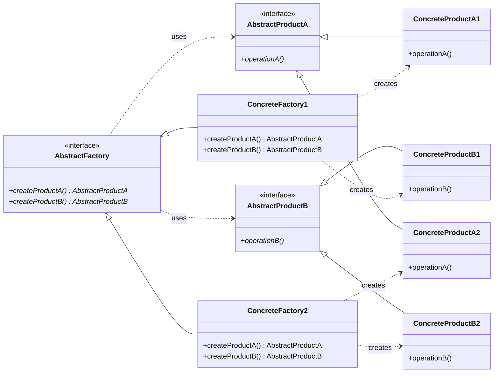

# Abstract Factory Pattern

## Description

The **Abstract Factory** pattern provides an interface for creating **families of related objects** without specifying their concrete classes.
It groups factories that share a common theme, ensuring products from one factory are compatible with each other.

---

## Key Features

- **Family Consistency**: All products created by a concrete factory belong to the same variant, guaranteeing compatibility.
- **Open/Closed Principle**: New product families are added by implementing a new concrete factory — existing client code is untouched.
- **Abstraction Over Creation**: The client works with factories and products solely through abstract interfaces, unaware of any concrete type.

---

## Participants

| Role | In `abstract_factory.cpp` | Responsibility |
|---|---|---|
| `AbstractProductA` | `AbstractProductA` | Abstract interface for the first product type |
| `AbstractProductB` | `AbstractProductB` | Abstract interface for the second product type |
| `ConcreteProductA1/A2` | `ConcreteProductA1`, `ConcreteProductA2` | Concrete variants of product A for each factory |
| `ConcreteProductB1/B2` | `ConcreteProductB1`, `ConcreteProductB2` | Concrete variants of product B for each factory |
| `AbstractFactory` | `AbstractFactory` | Declares creation methods for each abstract product type |
| `ConcreteFactory` | `ConcreteFactory1`, `ConcreteFactory2` | Creates the matching product variants for a specific family |
| Client | `main()` | Uses the abstract factory and products without knowing their concrete types |

---

## Advantages

- Guarantees that products from a single factory are mutually compatible.
- Isolates concrete classes from client code — clients depend only on abstractions.
- Switching product families requires changing only the concrete factory.

---

## Disadvantages

- Adding a new product type requires changing the abstract factory interface and all its concrete implementations.
- Can lead to a large number of classes when there are many products and variants.

---

## UML Diagram

