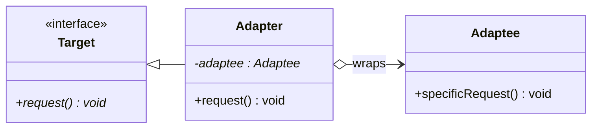

# Adapter Pattern

## Description

The **Adapter** pattern converts the interface of a class into another interface that clients expect.
It allows classes with incompatible interfaces to work together by wrapping the existing class in a new interface.

---

## Key Features

- **Interface Translation**: Bridges the gap between an existing class (`Adaptee`) and a required interface (`Target`).
- **Single Responsibility**: The adaptation logic is isolated in the `Adapter` class, keeping both `Target` and `Adaptee` unchanged.
- **Open/Closed Principle**: New adapters can be introduced without modifying existing client code or the adaptee.

---

## Participants

| Role | In `adapter.cpp` | Responsibility |
|---|---|---|
| `Target` | `Target` | Defines the domain-specific interface the client uses via `request()` |
| `Adaptee` | `Adaptee` | Contains the existing functionality (`specificRequest()`) with an incompatible interface |
| `Adapter` | `Adapter` | Wraps `Adaptee` and translates `request()` calls into `specificRequest()` calls |
| Client | `main()` | Works with `Target` interface, unaware of the underlying `Adaptee` |

---

## Advantages

- Enables reuse of existing classes without modifying their source code.
- Decouples the client from the concrete implementation of the adaptee.
- A single adapter can work with multiple adaptees sharing a common interface.

---

## Disadvantages

- Adds an extra layer of indirection, which can complicate the design.
- Sometimes it is simpler to change the adaptee directly if its source is available.
- Object adapter (composition-based) cannot override adaptee behavior; class adapter (inheritance-based) can but sacrifices flexibility.

---

## UML Diagram

