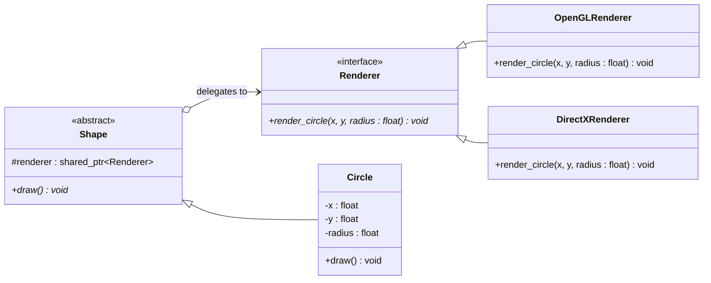

# Bridge Pattern

## Description

The **Bridge** pattern decouples an abstraction from its implementation so that the two can vary independently.
Instead of using inheritance to extend both dimensions, Bridge uses composition to delegate implementation work to a separate hierarchy.

---

## Key Features

- **Independent Variation**: Abstraction and implementation hierarchies can grow independently without combinatorial class explosion.
- **Open/Closed Principle**: New abstractions and implementations can be added without modifying existing code.
- **Composition Over Inheritance**: The abstraction holds a pointer to the implementation rather than inheriting from it.

---

## Participants

| Role | In `bridge.cpp` | Responsibility |
|---|---|---|
| Implementor | `Renderer` | Declares the rendering interface via `render_circle()` |
| Concrete Implementors | `OpenGLRenderer`, `DirectXRenderer` | Provide platform-specific rendering implementations |
| Abstraction | `Shape` | Holds a `shared_ptr<Renderer>` and declares `draw()` |
| Refined Abstraction | `Circle` | Extends `Shape` with concrete geometry; delegates rendering to the renderer |
| Client | `main()` | Creates renderers and injects them into shapes via the constructor |

---

## Advantages

- Avoids a permanent binding between abstraction and implementation.
- Hides implementation details from clients completely.
- Enables runtime switching of implementations.

---

## Disadvantages

- Increases overall design complexity with two separate class hierarchies.
- Indirection through the bridge can be harder to follow when debugging.
- Can be overkill when only one implementation is ever needed.

---

## UML Diagram

