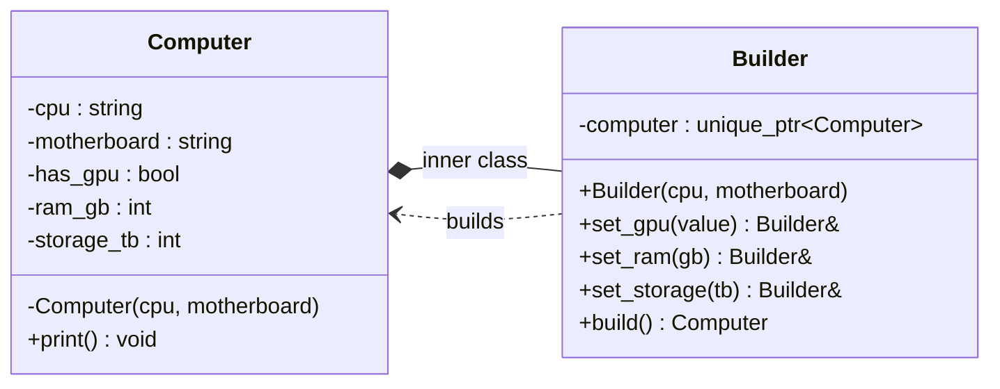

# Builder Pattern

## Description

The **Builder** pattern separates the **construction of a complex object** from its representation, allowing the same construction process to produce different results.
It is especially useful when an object has many optional parameters or requires a multi-step assembly process.

---

## Key Features

- **Step-by-Step Construction**: The object is assembled incrementally through discrete setter/configuration calls rather than a single constructor.
- **Fluent Interface**: Builder methods return a reference to the builder itself, enabling readable method chaining.
- **Encapsulation of Construction Logic**: The client never directly sets fields on the product — all construction goes through the builder.

---

## Participants

| Role | In `builder.cpp` | Responsibility |
|---|---|---|
| Product | `Computer` | The complex object being built; its constructor is private |
| Builder | `Computer::Builder` | Holds the product under construction and exposes configuration methods |
| Client | `main()` | Creates a `Builder`, chains configuration calls, and calls `build()` to obtain the finished product |

---

## Advantages

- Avoids telescoping constructors — optional parameters are set only when needed.
- The same builder interface can produce different product configurations.
- Construction and representation are cleanly separated.

---

## Disadvantages

- Requires creating a separate `Builder` class, increasing the number of types.
- Overkill for simple objects with few parameters.

---

## UML Diagram

