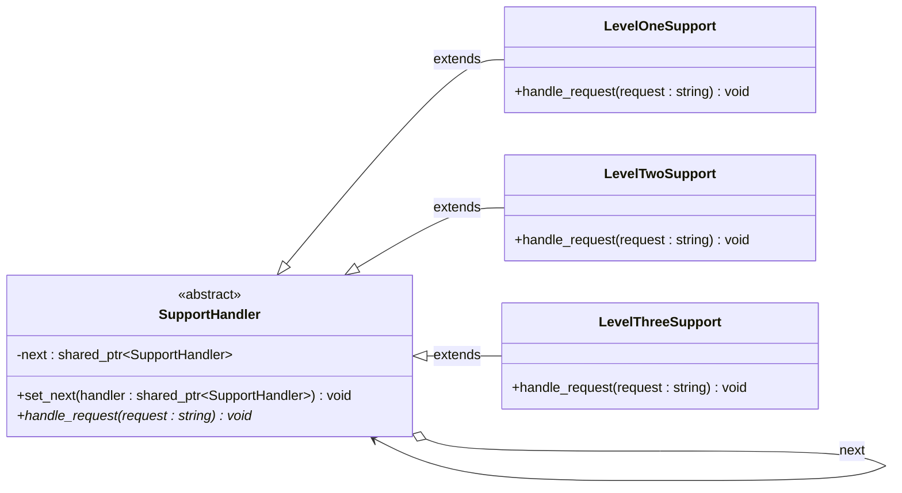

# Chain of Responsibility Pattern

## Description

The **Chain of Responsibility** pattern passes a request along a chain of handlers, where each handler decides either to process the request or to forward it to the next handler in the chain.
This decouples the sender of a request from its receivers, giving multiple objects a chance to handle it without the sender knowing which one will.

---

## Key Features

- **Decoupled Sender and Receiver**: The client submits a request to the first handler without knowing which handler will ultimately process it.
- **Dynamic Chain**: Handlers can be added, removed, or reordered at runtime by adjusting `set_next()` links.
- **Single Responsibility**: Each handler focuses only on requests it can handle and blindly forwards the rest.

---

## Participants

| Role | In `chain_of_responsibility.cpp` | Responsibility |
|---|---|---|
| Handler Interface | `SupportHandler` | Declares `handle_request()` and holds a `next` pointer; default implementation forwards to the next handler |
| Concrete Handlers | `LevelOneSupport`, `LevelTwoSupport`, `LevelThreeSupport` | Each handles requests matching its level; delegates all others up the chain |
| Client | `main()` | Builds the chain via `set_next()` and fires requests at the first handler |

---

## Advantages

- Reduces coupling between the sender and potential receivers.
- Handlers can be composed into flexible pipelines without changing client code.
- Adding new handlers requires no modification to existing handlers or the client.

---

## Disadvantages

- A request may go unhandled if no handler in the chain claims it.
- Debugging long chains can be difficult because the flow of control is implicit.
- Performance can degrade if the chain is long and most requests travel to the end.

---

## UML Diagram

