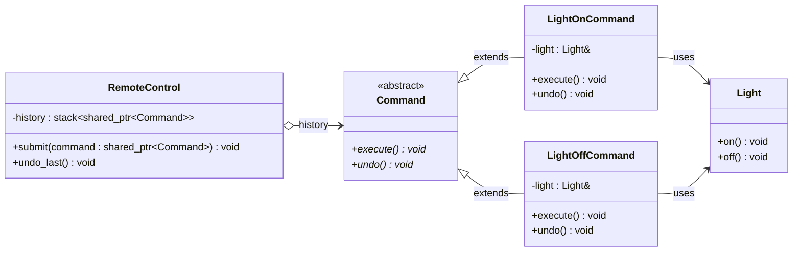

# Command Pattern

## Description

The **Command** pattern encapsulates a request as an object, allowing it to be parameterized, queued, logged, or undone.
The invoker is decoupled from the object that performs the action — it only knows how to call `execute()` on a command.

---

## Key Features

- **Encapsulated Request**: Each operation is wrapped in a command object with a uniform interface (`execute()` / `undo()`).
- **Decoupled Invoker and Receiver**: The invoker (`RemoteControl`) has no knowledge of `Light`; it only holds `Command` pointers.
- **Undo Support**: Commands store enough state to reverse their effect, enabling a history-based undo stack.

---

## Participants

| Role | In `command.cpp` | Responsibility |
|---|---|---|
| Command Interface | `Command` | Declares `execute()` and `undo()` |
| Concrete Commands | `LightOnCommand`, `LightOffCommand` | Bind a receiver (`Light`) to a specific action and its inverse |
| Receiver | `Light` | Knows how to perform the actual work (`on()`, `off()`) |
| Invoker | `RemoteControl` | Calls `execute()` on submitted commands and maintains a history stack for undo |
| Client | `main()` | Creates commands, wires them to receivers, and hands them to the invoker |

---

## Advantages

- Decouples the object that triggers an operation from the object that performs it.
- Commands can be queued, serialized, logged, or scheduled without changing either the invoker or the receiver.
- Undo/redo is straightforward: store executed commands in a stack and call `undo()` in reverse order.

---

## Disadvantages

- Introduces a new class for every distinct operation, which can lead to a large number of small classes.
- The indirection can make call stacks harder to follow during debugging.

---

## UML Diagram

