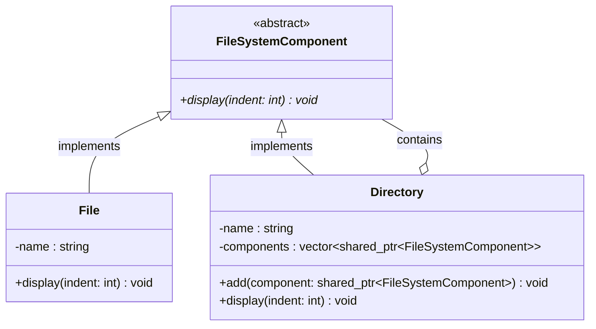

# Composite Pattern

## Description

The **Composite** pattern composes objects into **tree structures to represent part-whole hierarchies**.
It lets clients treat individual objects (leaves) and compositions of objects (composites) uniformly through a shared interface.

---

## Key Features

- **Uniform Interface**: Both leaves and composites implement the same abstract component interface, so the client does not need to distinguish between them.
- **Recursive Composition**: Composite nodes hold a collection of child components, each of which can itself be a composite or a leaf.
- **Transparent Tree Traversal**: Operations like `display()` propagate automatically down the tree via polymorphic dispatch.

---

## Participants

| Role | In `composite.cpp` | Responsibility |
|---|---|---|
| Component | `FileSystemComponent` | Abstract base class declaring the common interface (`display()`) |
| Leaf | `File` | Implements the interface; has no children |
| Composite | `Directory` | Implements the interface; holds and manages child `FileSystemComponent` instances |
| Client | `main()` | Builds the tree and calls operations on the root without knowing the concrete types |

---

## Advantages

- Clients can work with complex tree structures through a single, simple interface.
- Adding new leaf or composite types requires no changes to the client code.
- Recursive tree operations (display, calculate, traverse) are easy to implement.

---

## Disadvantages

- The common interface may force leaf classes to expose child-management methods they do not need (or to leave them as no-ops).
- Enforcing constraints on which components may be children of which composites is harder when everything shares one interface.

---

## UML Diagram

