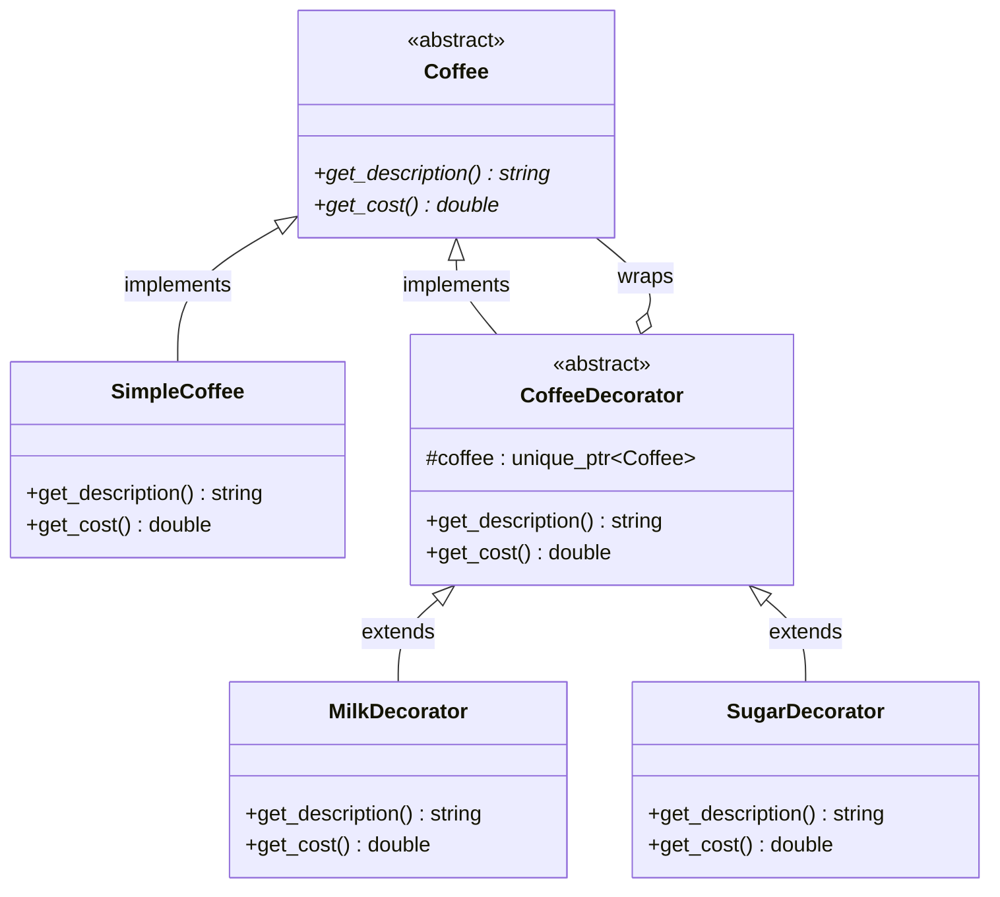

# Decorator Pattern

## Description

The **Decorator** pattern attaches additional responsibilities to an object **dynamically**.
It provides a flexible alternative to subclassing for extending functionality by wrapping objects in decorator classes that share the same interface.

---

## Key Features

- **Transparent Wrapping**: Decorators implement the same interface as the component they wrap, so the client cannot distinguish a decorated object from the original.
- **Stackable Composition**: Multiple decorators can be layered in any order, with each one adding its own behavior on top of the previous.
- **Open/Closed Principle**: New behaviors can be added without modifying existing component or decorator classes.

---

## Participants

| Role | In `decorator.cpp` | Responsibility |
|---|---|---|
| Component | `Coffee` | Abstract interface declaring `get_description()` and `get_cost()` |
| Concrete Component | `SimpleCoffee` | Base object whose behavior is to be extended |
| Base Decorator | `CoffeeDecorator` | Holds a `unique_ptr<Coffee>` and forwards calls to the wrapped component |
| Concrete Decorators | `MilkDecorator`, `SugarDecorator` | Add their own description and cost on top of the wrapped component |
| Client | `main()` | Composes decorators at runtime and works through the `Coffee` interface |

---

## Advantages

- Responsibilities can be added or removed at runtime by wrapping or unwrapping objects.
- Avoids a combinatorial explosion of subclasses when many independent extensions are needed.
- Each decorator class has a single, well-defined responsibility.

---

## Disadvantages

- Produces many small objects that can be harder to debug and inspect.
- The order in which decorators are applied can affect the result and must be managed carefully.
- Removing a specific decorator from the middle of a stack requires reconstructing the chain.

---

## UML Diagram

