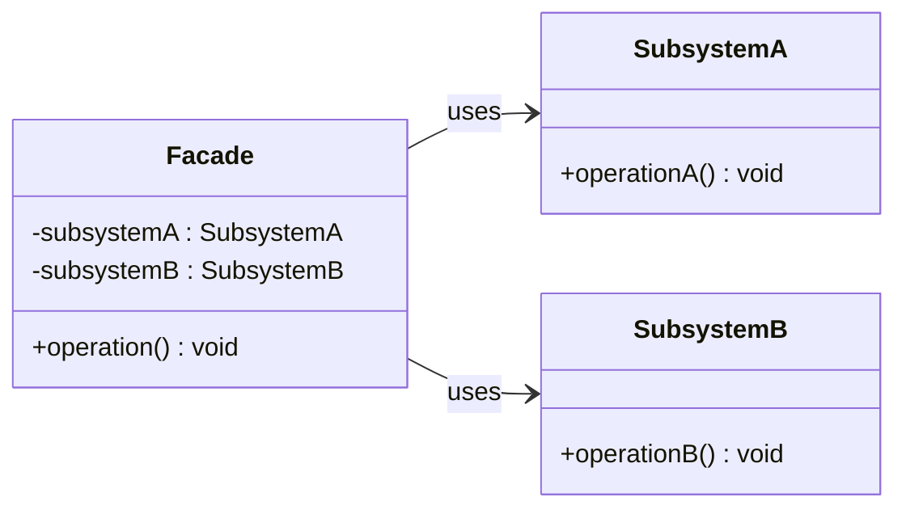

# Facade Pattern

## Description

The **Facade** pattern provides a simplified interface to a complex subsystem.
It hides the complexity of the subsystem behind a single unified interface, making the subsystem easier to use.

---

## Key Features

- **Simplified Interface**: Exposes a high-level interface that makes the subsystem easier to use without exposing its internal complexity.
- **Loose Coupling**: Clients depend only on the `Facade`, not on individual subsystem classes.
- **Single Entry Point**: Centralizes interaction with the subsystem, reducing the number of objects clients deal with.

---

## Participants

| Role | In `facade.cpp` | Responsibility |
|---|---|---|
| `Facade` | `Facade` | Provides a simple `operation()` interface that delegates to subsystem classes |
| Subsystem classes | `SubsystemA`, `SubsystemB` | Implement subsystem functionality; unaware of the facade |
| Client | `main()` | Uses only `Facade`, unaware of the underlying subsystems |

---

## Advantages

- Reduces complexity for clients by providing a simpler interface.
- Decouples client code from subsystem internals, making subsystem changes transparent.
- Can layer multiple facades over a complex subsystem for different use cases.

---

## Disadvantages

- Can become a "god object" if it accumulates too many responsibilities.
- May hide useful subsystem features that advanced clients need.
- Does not prevent clients from accessing subsystem classes directly if needed.

---

## UML Diagram

