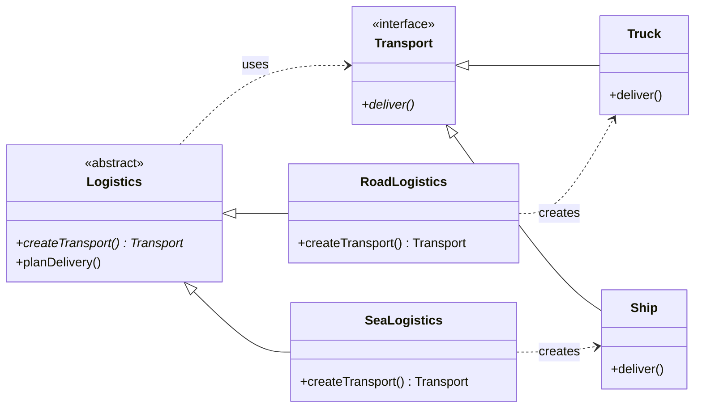

# Factory Method Pattern

## Description

The **Factory Method** pattern defines an interface for creating an object, but lets **subclasses decide which class to instantiate**.
It delegates object creation to subclasses, decoupling the client code from the concrete types it uses.

---

## Key Features

- **Deferred Instantiation**: The creator class defers object creation to subclasses via a virtual factory method.
- **Open/Closed Principle**: New product types are added by subclassing the creator — existing code is untouched.
- **Polymorphic Creation**: The client works with products through an abstract interface, unaware of the concrete type.

---

## Participants

| Role | In `factory_method.cpp` | Responsibility |
|---|---|---|
| `Product` | `Transport` | Abstract interface for the created objects |
| `ConcreteProduct` | `Truck`, `Ship` | Concrete implementations of the product |
| `Creator` | `Logistics` | Declares the factory method; uses the product in `planDelivery()` |
| `ConcreteCreator` | `RoadLogistics`, `SeaLogistics` | Overrides the factory method to return a specific product |
| Client | `main()` | Works with creators through the `Logistics` interface |

---

## Advantages

- Eliminates tight coupling between creator and concrete products.
- Single Responsibility: product creation is isolated in one place.
- Easy to extend — add a new transport type without touching existing classes.

---

## Disadvantages

- Requires a new subclass per product type, which can grow the class hierarchy.
- Adds indirection — may be over-engineering for simple object creation.

---

## UML Diagram

