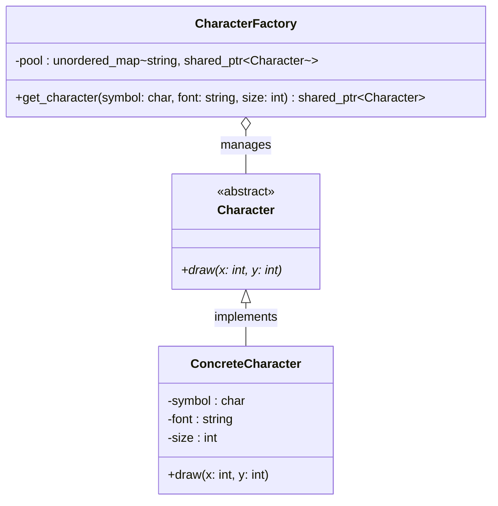

# Flyweight Pattern

## Description

The **Flyweight** pattern reduces memory usage by sharing as much data as possible among similar objects.
It separates object state into **intrinsic** (shared, immutable) and **extrinsic** (unique per context) parts, storing only the intrinsic state inside the flyweight and passing extrinsic state at call time.

---

## Key Features

- **Intrinsic vs. Extrinsic State**: Intrinsic state is stored in the flyweight and shared; extrinsic state is supplied by the client on each operation.
- **Object Pool via Factory**: A factory maintains a pool of already-created flyweights and returns existing instances instead of allocating new ones.
- **Transparent to Clients**: Clients interact with flyweights through a common interface and are unaware of whether an object was created fresh or reused.

---

## Participants

| Role | In `flyweight.cpp` | Responsibility |
|---|---|---|
| Flyweight Interface | `Character` | Abstract interface declaring `draw(int x, int y)` |
| Concrete Flyweight | `ConcreteCharacter` | Stores intrinsic state (`symbol`, `font`, `size`) and implements `draw()` |
| Flyweight Factory | `CharacterFactory` | Manages the pool; creates a `ConcreteCharacter` on first request, returns the cached one on subsequent requests |
| Client | `main()` | Requests flyweights from the factory and supplies extrinsic state (`x`, `y`) at draw time |

---

## Advantages

- Significantly reduces memory consumption when large numbers of similar objects are needed.
- Centralizes shared state management in the factory, keeping individual objects lightweight.
- Works well alongside other structural patterns such as Composite.

---

## Disadvantages

- Introduces complexity by splitting state into intrinsic and extrinsic parts.
- Extrinsic state must be computed or looked up by the client before each operation, which can add CPU overhead.
- The pattern is only beneficial when the number of shared instances is significantly smaller than the total number of logical objects.

---

## UML Diagram

