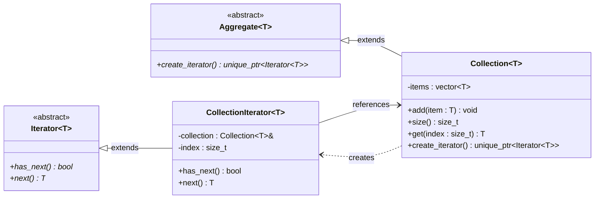

# Iterator Pattern

## Description

The **Iterator** pattern provides a way to sequentially access elements of a collection without exposing its underlying representation.
The collection exposes an iterator object that encapsulates traversal logic, keeping the client decoupled from the container's internal structure.

---

## Key Features

- **Uniform Traversal Interface**: Clients iterate over any collection using the same `has_next()` / `next()` interface, regardless of storage type.
- **Encapsulated Traversal**: Iteration state (e.g. current index) lives in the iterator, not in the collection or the client.
- **Decoupled Collection and Client**: The client holds only an `Iterator<T>` pointer and never touches the collection directly after obtaining it.

---

## Participants

| Role | In `iterator.cpp` | Responsibility |
|---|---|---|
| Iterator Interface | `Iterator<T>` | Declares `has_next()` and `next()` |
| Concrete Iterator | `CollectionIterator<T>` | Maintains traversal state (index) and implements iteration over `Collection<T>` |
| Aggregate Interface | `Aggregate<T>` | Declares `create_iterator()` factory method |
| Concrete Aggregate | `Collection<T>` | Stores items, implements `create_iterator()` returning a `CollectionIterator` |
| Client | `main()` | Obtains an iterator from the collection and drives traversal via `has_next()` / `next()` |

---

## Advantages

- Hides the internal structure of the collection from the client.
- Multiple independent iterators can traverse the same collection simultaneously without interfering.
- New iterator strategies (reverse, filtered) can be added without modifying the collection.

---

## Disadvantages

- Adds a layer of indirection; may be overkill for collections that already expose index-based access.
- Each traversal requires heap-allocating a new iterator object (in this polymorphic form).

---

## UML Diagram

