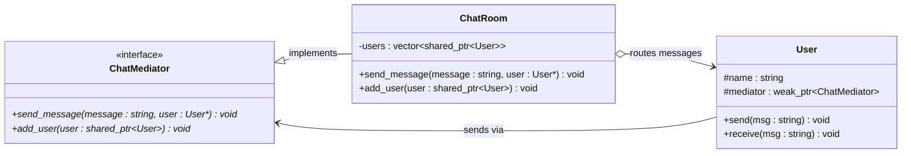

# Mediator Pattern

## Description

The **Mediator** pattern defines an object that encapsulates how a set of objects interact.
Instead of components communicating directly with each other, they communicate through a central mediator, reducing the direct dependencies between them.

---

## Key Features

- **Centralized Communication**: All inter-component communication is routed through the mediator, replacing a many-to-many dependency graph with a many-to-one structure.
- **Decoupled Components**: Components (colleagues) know only about the mediator interface, not about each other.
- **Single Responsibility**: The mediator owns the coordination logic, keeping individual components focused on their own behavior.

---

## Participants

| Role | In `mediator.cpp` | Responsibility |
|---|---|---|
| Mediator Interface | `ChatMediator` | Declares `send_message()` and `add_user()` for coordinating colleagues |
| Concrete Mediator | `ChatRoom` | Implements message routing — forwards each message to all users except the sender |
| Colleague | `User` | Holds a `weak_ptr` to the mediator; sends and receives messages only through it |
| Client | `main()` | Creates the mediator, registers users, and triggers communication |

---

## Advantages

- Eliminates tight coupling between communicating components.
- Centralizes control logic, making it easier to change interaction rules in one place.
- Adding new components requires no changes to existing colleagues, only registration with the mediator.

---

## Disadvantages

- The mediator can grow into a large, complex "god object" if coordination logic becomes extensive.
- Centralizing all interactions in one place can make the mediator a single point of failure.
- Can be harder to trace message flow compared to direct calls between objects.

---

## UML Diagram

