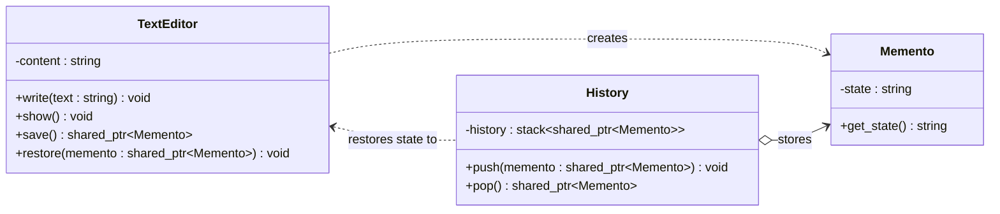

# Memento Pattern

## Description

The **Memento** pattern captures and externalizes an object's internal state so it can be restored later, without violating encapsulation.
It is commonly used to implement undo/redo functionality.

---

## Key Features

- **Encapsulation Preservation**: The originator's internal state is saved and restored without exposing it to the outside world.
- **Undo/Redo Support**: A caretaker can maintain a history of mementos to support multi-level undo operations.
- **Separation of Concerns**: The caretaker manages the history but knows nothing about the contents of mementos.

---

## Participants

| Role | In `memento.cpp` | Responsibility |
|---|---|---|
| `Memento` | `Memento` | Stores a snapshot of the originator's state via `get_state()` |
| `Originator` | `TextEditor` | Creates mementos via `save()` and restores state via `restore()` |
| `Caretaker` | `History` | Maintains a stack of mementos via `push()` and `pop()`; never inspects their contents |
| Client | `main()` | Drives editing, saves checkpoints, and triggers undos |

---

## Advantages

- Provides a clean undo mechanism without exposing internal state.
- Keeps the originator's implementation independent of how history is managed.
- The caretaker is simple — it only stores and returns opaque snapshots.

---

## Disadvantages

- Can consume significant memory if snapshots are large or saved frequently.
- The caretaker must track the lifecycle of mementos to avoid memory leaks (mitigated here with `shared_ptr`).
- Deep copying complex state can be expensive.

---

## UML Diagram

