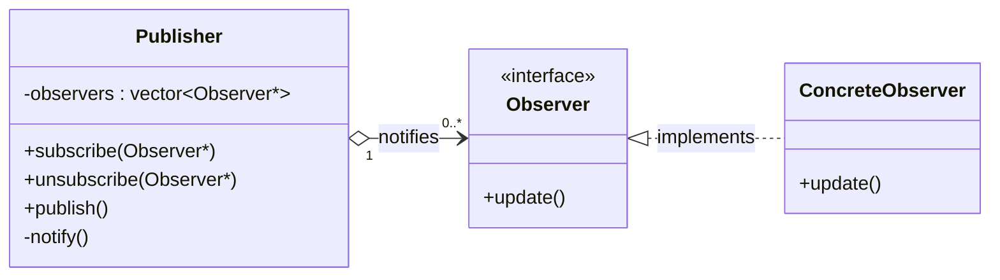

# Observer Pattern

## Description

The **Observer** pattern defines a **one-to-many dependency** between objects so that when one object (the **Publisher**) changes state, all its dependents (**Observers**) are notified and updated automatically.
It is useful for implementing event-driven systems, e.g., UI event handling, pub/sub messaging, or reactive data bindings.

---

## Key Features

- **Loose Coupling**: Publishers and observers interact through an abstract interface.
- **Dynamic Subscription**: Observers can subscribe and unsubscribe at runtime.
- **Broadcast Notification**: A single `publish()` call notifies all registered observers.

---

## Advantages

- Decouples the publisher from its observers.
- Supports open/closed principle — new observer types can be added without changing the publisher.
- Enables event-driven architectures naturally.

---

## Disadvantages

- Observers are notified in an unspecified order.
- Memory/dangling pointer risk if observers are destroyed without unsubscribing.
- Can cause unexpected cascading updates if observers trigger further events.

---

## UML Diagram

---
