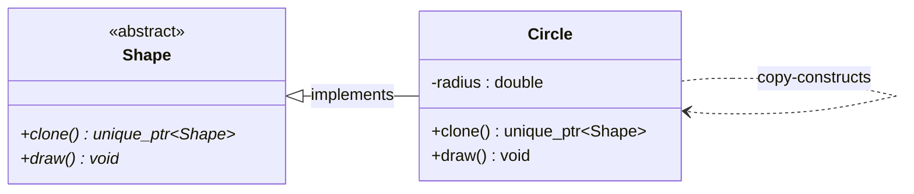

# Prototype Pattern

## Description

The **Prototype** pattern creates new objects by **cloning an existing instance** (the prototype) rather than constructing them from scratch.
It is useful when object creation is expensive or complex, and a similar object already exists that can be copied and tweaked.

---

## Key Features

- **Clone-Based Creation**: New objects are produced by copying an existing prototype via a `clone()` method.
- **Polymorphic Cloning**: The `clone()` method is declared on the abstract base class, so clients can clone any concrete type through a base pointer without knowing the actual type.
- **Decoupling from Concrete Classes**: The client depends only on the abstract interface, not on specific subclasses.

---

## Participants

| Role | In `prototype.cpp` | Responsibility |
|---|---|---|
| Prototype | `Shape` | Abstract base class declaring the `clone()` interface |
| Concrete Prototype | `Circle` | Implements `clone()` by copy-constructing itself and returning a `unique_ptr<Shape>` |
| Client | `main()` | Holds a prototype instance and calls `clone()` to produce new objects |

---

## Advantages

- Avoids the cost of re-initialising objects from scratch when a similar object already exists.
- Adding new concrete types requires no changes to the client — just implement `clone()`.
- Hides the complexity of object creation behind a uniform interface.

---

## Disadvantages

- Deep-cloning objects with circular references or shared state can be tricky to implement correctly.
- Every concrete class must implement `clone()`, which can be tedious for large class hierarchies.

---

## UML Diagram

