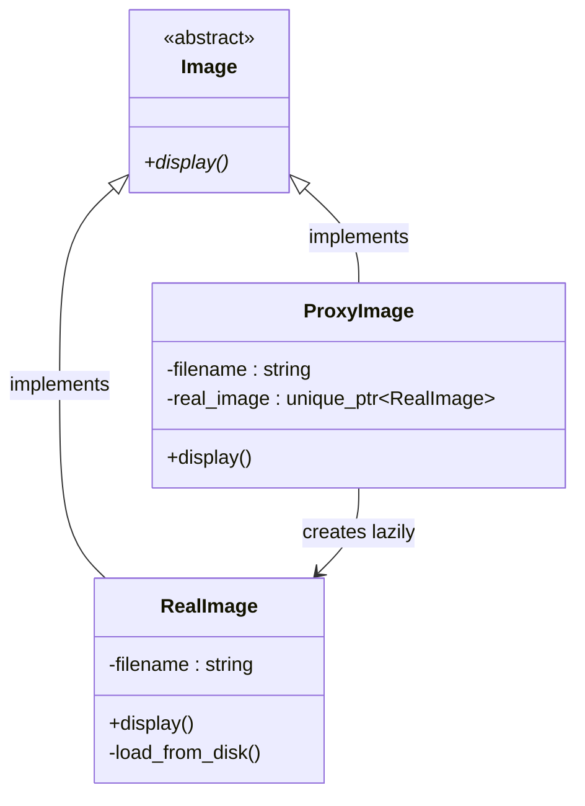

# Proxy Pattern

## Description

The **Proxy** pattern provides a surrogate or placeholder object that controls access to another object.
The proxy sits in front of the real subject and intercepts requests, allowing it to perform additional work — such as lazy initialization, access control, logging, or caching — before or after forwarding the call.

---

## Key Features

- **Same Interface as Subject**: The proxy implements the same interface as the real subject, making it transparent to the client.
- **Controlled Access**: The proxy decides when and whether to delegate to the real subject, enabling lazy creation, permission checks, or resource management.
- **Single Responsibility**: Additional concerns (loading, logging, caching) are isolated in the proxy, keeping the real subject clean.

---

## Participants

| Role | In `proxy.cpp` | Responsibility |
|---|---|---|
| Subject Interface | `Image` | Abstract interface declaring `display()` |
| Real Subject | `RealImage` | Loads the image from disk on construction and displays it |
| Proxy | `ProxyImage` | Defers creation of `RealImage` until the first `display()` call (lazy initialization) |
| Client | `main()` | Works through the `Image` interface, unaware of whether it holds a real object or a proxy |

---

## Advantages

- Lazy initialization avoids the cost of creating expensive objects until they are actually needed.
- The proxy can add cross-cutting concerns (logging, caching, access control) without touching the real subject.
- Clients remain decoupled from the lifecycle and creation details of the real subject.

---

## Disadvantages

- Introduces an additional layer of indirection that can complicate debugging.
- Response time may increase slightly due to the forwarding overhead.
- The number of classes grows because each subject typically needs its own proxy.

---

## UML Diagram

