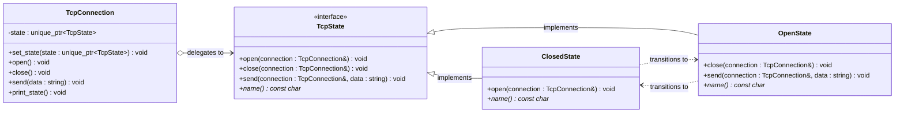

# State Pattern

## Description

The **State** pattern allows an object to alter its behavior when its internal state changes.
The object will appear to change its class — each state is encapsulated in its own class, and the context delegates behavior to the current state object.

---

## Key Features

- **State Encapsulation**: Each state's behavior is isolated in its own class, keeping the context clean.
- **Implicit Transitions**: State objects trigger transitions by replacing the context's current state directly.
- **Open/Closed Principle**: New states can be added without modifying the context or existing state classes.

---

## Participants

| Role | In `state.cpp` | Responsibility |
|---|---|---|
| State Interface | `TcpState` | Declares `open()`, `close()`, and `send()` with default "invalid operation" behavior |
| Concrete State | `ClosedState`, `OpenState` | Override only the operations valid in that state; trigger transitions via `set_state()` |
| Context | `TcpConnection` | Holds the current state as a `unique_ptr`; delegates all operations to it |
| Client | `main()` | Creates a connection in `ClosedState` and drives it through open/send/close operations |

---

## Advantages

- Eliminates large conditional branches (`if/switch` on state) by distributing behavior across state classes.
- Adding a new state requires only a new class — no changes to the context or other states.
- Each state class is small and focused, making individual states easy to test.

---

## Disadvantages

- Can lead to many small classes if the number of states is large.
- State transitions are scattered across state classes, which can make the overall flow harder to trace.
- Sharing state objects between contexts requires care (not applicable here — each context owns its state via `unique_ptr`).

---

## UML Diagram

