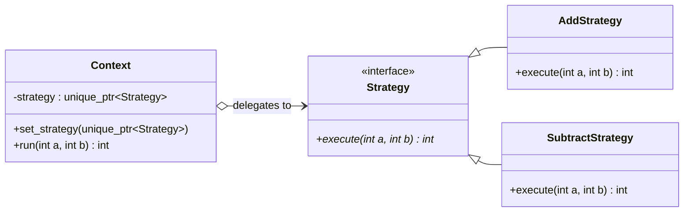

# Strategy Pattern

## Description

The **Strategy** pattern defines a family of algorithms, encapsulates each one, and makes them interchangeable.
It lets the algorithm vary independently from the clients that use it.

---

## Key Features

- **Open/Closed Principle**: New strategies can be added without modifying the `Context`.
- **Runtime Flexibility**: The algorithm can be swapped at runtime via `set_strategy()`.
- **Single Responsibility**: Each concrete strategy encapsulates one algorithm.

---

## Participants

| Role | In `strategy.cpp` | Responsibility |
|---|---|---|
| `Strategy` | `Strategy` | Declares the common `execute()` interface |
| `ConcreteStrategy` | `AddStrategy`, `SubtractStrategy` | Implements a specific algorithm |
| `Context` | `Context` | Holds a strategy and delegates work to it via `run()` |
| Client | `main()` | Selects and injects the desired strategy into the context |

---

## Advantages

- Eliminates conditional branching (`if`/`switch`) for algorithm selection.
- Strategies are independently testable and reusable.
- Adding a new algorithm requires only a new class, not changes to existing code.

---

## Disadvantages

- Clients must be aware of available strategies to choose one.
- Can be overkill when only a few simple variations exist.
- Slight overhead from virtual dispatch and heap allocation per strategy.

---

## UML Diagram

