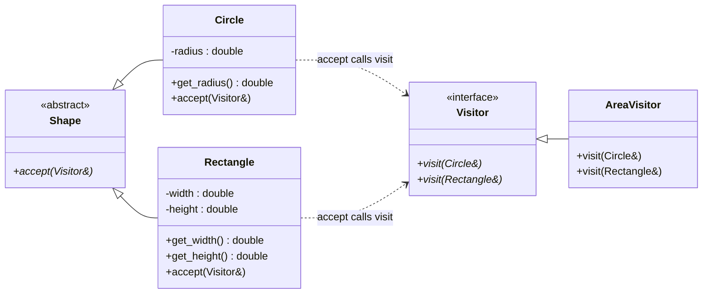

# Visitor Pattern

## Description

The **Visitor** pattern lets you add new operations to existing class hierarchies **without modifying those classes**.
It separates an algorithm from the object structure it operates on by placing the algorithm in a separate *visitor* object.

---

## Key Features

- **Double Dispatch**: The correct `visit()` overload is selected based on both the visitor type and the element type.
- **Open/Closed Principle**: New operations are added via new visitor classes; element classes stay untouched.
- **Separation of Concerns**: Data structure (elements) and algorithms (visitors) live independently.

---

## Participants

| Role | In `visitor.cpp` | Responsibility |
|---|---|---|
| `Visitor` | `Visitor` | Declares a `visit()` overload for each element type |
| `ConcreteVisitor` | `AreaVisitor` | Computes the area for each concrete shape type |
| Element Interface | `Shape` | Declares `accept(Visitor&)` |
| Concrete Elements | `Circle`, `Rectangle` | Implement `accept()` and expose geometry via getters |
| Client | `main()` | Constructs shapes and visitors, triggers traversal |

---

## How It Works

1. The client calls `element.accept(visitor)`.
2. Inside `accept`, the element calls `visitor.visit(*this)` — passing itself.
3. Because `*this` is a concrete type, C++ static overload resolution picks the right `visit()` overload.
4. The visitor executes its operation on the element.

This two-step dispatch (virtual `accept` + overloaded `visit`) is the core of the pattern.

---

## Advantages

- Add new operations without changing element classes.
- Related behaviour is co-located inside one visitor class.
- Visitors can accumulate state across multiple elements.

---

## Disadvantages

- Adding a new element type requires updating **every** visitor.
- Breaks encapsulation if visitors need access to private element state.
- Can become verbose when many element types exist.

---

## UML Diagram

